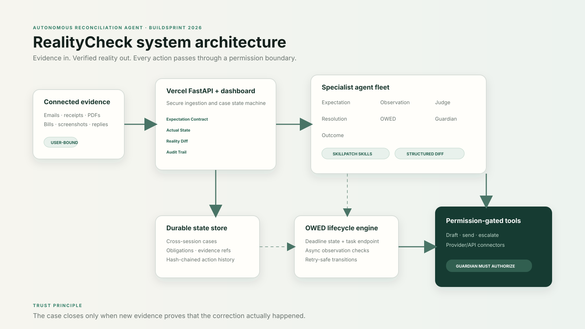
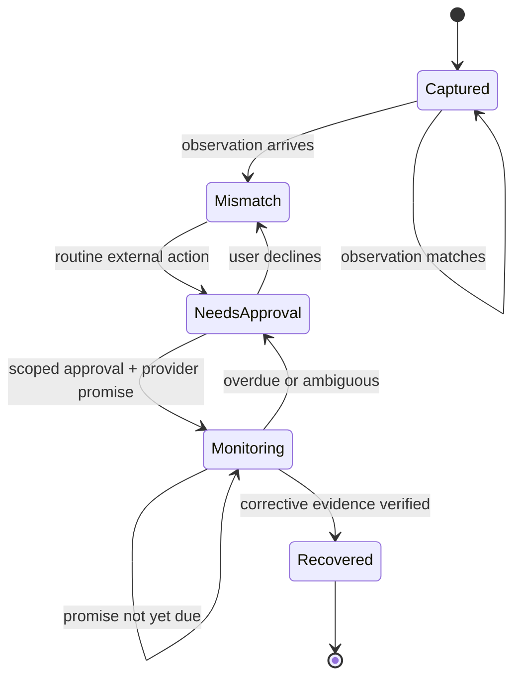

# Architecture

RealityCheck separates semantic understanding from deterministic truth checks and separates both from permissioned action.

## State flow

## Boundary decisions

1. Gemini extracts semantic facts and evidence spans; the numeric/date/spec diff is deterministic wherever possible.
2. A mismatch is not automatically wrongdoing. The Judge receives line-item explanations and preserves uncertainty.
3. The Resolution Agent cannot bypass Guardian policy. L3/L4 actions always need stronger authorization.
4. A provider response is not an outcome. The OWED Agent converts it into a new obligation and the Outcome Agent requires later proof.
5. Local development uses SQLite for zero-friction reproducibility. The public production runtime uses Firestore through a dedicated least-privilege service identity and the same typed transactional case model.
6. Every audit event commits to the previous event hash. Rewriting an earlier event invalidates the chain.

## Deployment topology

- Vercel hosts the stateless FastAPI dashboard and API on its free tier.
- Google Cloud Firestore in `argus-489918` stores case documents and audit history in `asia-south1` using its default-database free quota.
- The authenticated task endpoint is implemented; Cloud Scheduler and Pub/Sub remain an optional billing-enabled topology rather than a live claim.
- Gemini Developer API can be accessed with a free-tier API key stored as a platform secret. Vertex AI remains available for the optional Cloud Run topology.
- Structured logs contain case/action identifiers but exclude full evidence text.

## Honest external boundary

The public demo calls a typed provider connector backed by the fictional FiberMax sandbox. It exercises the real action packet, reply parsing, obligation creation, deadline, and outcome verification without claiming that a real company was contacted. Replacing that connector with an approved provider API does not change the case state machine or Guardian policy.
